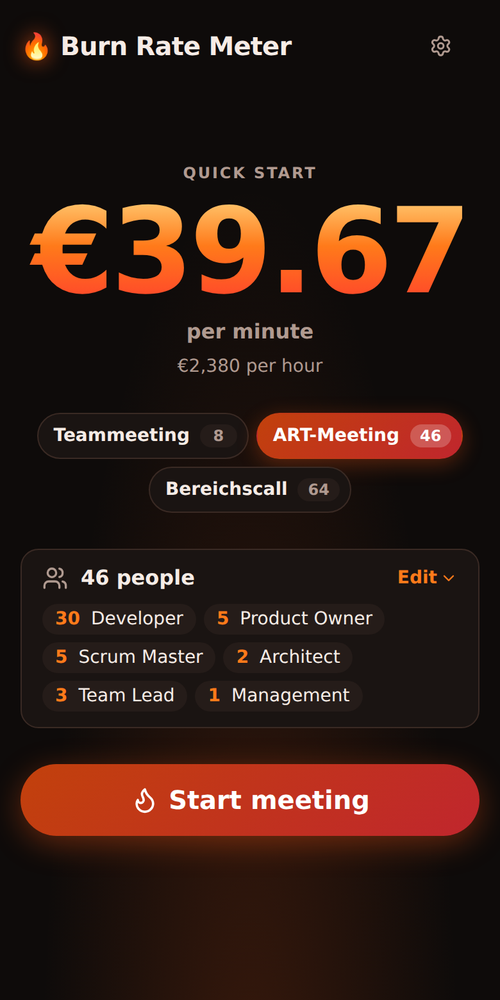
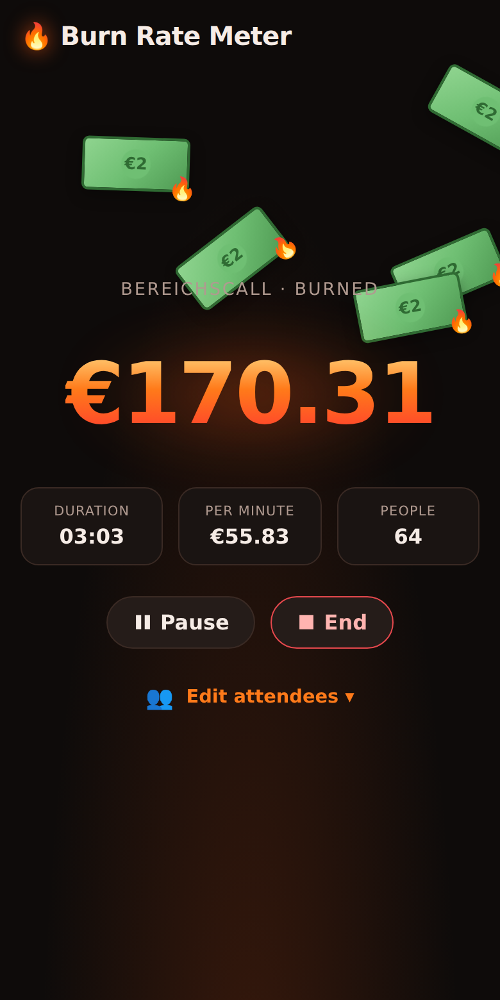
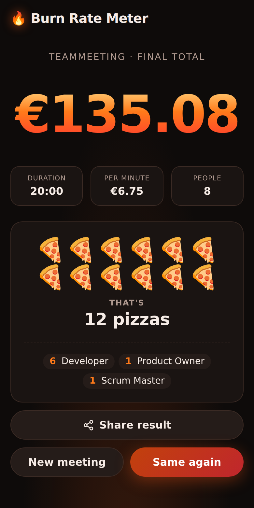

# 🔥 Burn Rate Meter

How much money is this meeting burning right now? Pick who is in the room, start the meeting – and watch the bills fall.

**▶ [Open the app](https://ubongfx.github.io/burn-rate-meter/)**

<p align="center">
  
  
  
</p>

## Features

- **Quick start:** pick a preset (team meeting, ART meeting, department call) or count attendees per role, and see the cost per minute before you start
- **Roles with realistic rates:** Developer, Product Owner, Scrum Master, Architect, Team Lead and Management, based on average German salaries (gross × 1.23 employer costs ÷ 1,650 productive hours)
- **Live counter:** a ticking € counter with falling bills, pause/resume, and people joining or leaving mid-meeting – only the time from then on uses the new rate
- **Result:** what the meeting cost in pizzas, laptops or holidays, and who was there
- **Share:** the result as an image and text – through the share sheet on phones, or saved and copied on desktop
- **Settings:** your own roles, rates, default attendance, presets and bill value, saved in your browser
- **German & English, light & dark:** detected from your system, or set in the settings
- **Works on phones:** install it to your home screen, use it offline; the screen stays on while a meeting runs

## Development

```bash
npm install
npm run dev          # dev server
npm test             # unit tests (Vitest)
npm run test:e2e     # end-to-end tests in Chromium and Firefox (first run: npx playwright install --only-shell chromium firefox)
npm run lint         # oxlint
npm run build        # type-check + production build
npm run screenshots  # regenerate the screenshots above
npm run brand-assets # regenerate the app icons and the link preview image
```

Built with Vite, React, TypeScript and [Motion](https://motion.dev).

## License

[MIT](LICENSE)
